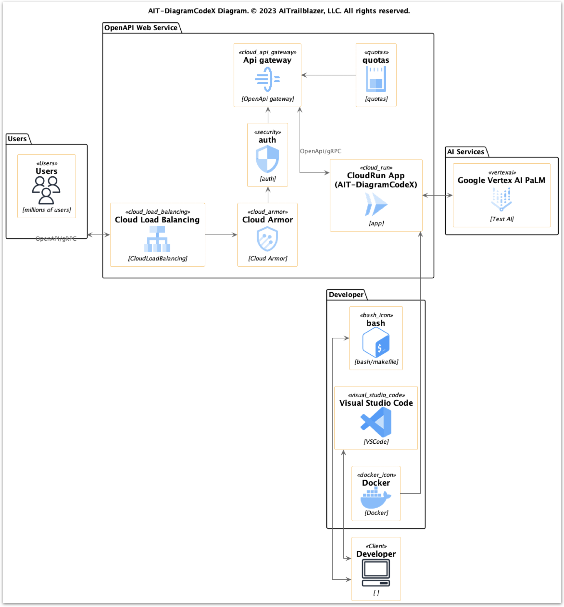

# Welcome to AIT-DiagramCodeX

[Link to AIT-DiagramCodeX PDF](https://github.com/aitrailblazer/AIT-DiagramCodeX-DEMO/blob/main/AIT-DiagramCodeX-Final.pdf)

# Table of Contents

1. [Introducing AIT-DiagramCodeX - Revolutionizing Diagramming, Coding, and Documentation](#1-introducing-ait-diagramcodex---revolutionizing-diagramming-coding-and-documentation)

2. [Navigating the Competitive Landscape](#2-navigating-the-competitive-landscape)

3. [The AIT-DiagramCodeX Advantage: Transforming Enterprise Workflows](#3-the-ait-diagramcodex-advantage-transforming-enterprise-workflows)

4. [Revolutionizing Diagrams: Our Four-Part User Interface](#4-revolutionizing-diagrams-our-four-part-user-interface)

5. [Mastering Complexity: Our Intelligent Pipelines](#5-mastering-complexity-our-intelligent-pipelines)

6. [AIT-DiagramCodeX Architecture](#6-ait-diagramcodex-architecture)

7. [AIT-DiagramCodeX: Trailblazing the Path of Innovation with AI-Enabled Visualization and Code Generation](#7-ait-diagramcodex-trailblazing-the-path-of-innovation-with-ai-enabled-visualization-and-code-generation)

8. [Standout Features of AIT-DiagramCodeX: Elevating Your Workflow](#8-standout-features-of-ait-diagramcodex-elevating-your-workflow) 

9. [Potential Users: Expanding the Scope of AIT-DiagramCodeX](#9-potential-users-expanding-the-scope-of-ait-diagramcodex) 

10. [Charting the Path for Sustainable Growth: Monetizing AIT-DiagramCodeX](#10-charting-the-path-for-sustainable-growth-monetizing-ait-diagramcodex)  

11. [Future Directions: Paving the Way for AIT-DiagramCodeX's Evolution](#11-future-directions-paving-the-way-for-ait-diagramcodexs-evolution)

## 1) Introducing AIT-DiagramCodeX - Revolutionizing Diagramming, Coding, and Documentation
Aye-Tee - Diagram - Code - Ex

We've all experienced it - sitting in a meeting when a complex workflow is verbally explained, only to realize later everyone walked away with a different interpretation. This kind of misalignment is all too common in large organizations.

Effective documentation is critical to avoiding these issues, yet often falls short. Tribal knowledge silos, inconsistent diagrams, outdated specifications - these pitfalls lead to fragmented understanding across teams and frustratingly slow workflows.

I experienced these documentation gaps first-hand throughout my career. Valuable engineering and product knowledge vanished when colleagues left the company. Onboarding new hires took months due to lack of materials. Meetings wasted time aligning on basic architecture and flows.

It became clear we needed a better way to create and share documentation - one that was visual, centralized, and easy to maintain. But after evaluating solutions on the market, none met the robust needs of enterprise-scale documentation.

That's why I built AIT-DiagramCodeX. It revolutionizes diagramming, coding, and documentation by enabling anyone to:

**Automatic Code Generation
* **Producing functional code right from diagrams. No more translation errors or misalignments.**

**Real-Time Updates
* **Diagrams and code remain in sync, updating automatically as systems evolve. Always up-to-date.**

**Instant Clarity**

* **Converting ambiguous verbal descriptions into clear, unambiguous diagrams with just a few clicks. No more confusion or misalignment.**

**Democratized Visualization**

* **Democratizing visualization so every employee can create diagrams, not just trained specialists. Empower your entire workforce.**

**Enhanced Workflows** 

* **Integrating seamlessly into existing workflows to enhance documentation and training initiatives enterprise-wide.**

**Cross-Functional Collaboration**

* **Fostering understanding and collaboration across all departments and seniority levels. Reduce cross-functional friction.** 

**Massive Time Savings**

* **Saving thousands of hours otherwise spent manually creating and updating diagrams. Unlock massive productivity gains.**

Don't let communication breakdowns continue plaguing your organization's efficiency and alignment. Transform complex concepts into intuitive visuals for all with AIT-DiagramCodeX - purpose-built to meet the scale and needs of today's enterprises.

## 2) Navigating the Competitive Landscape
| Features/Tools | AIT-DiagramCodeX | Whimsical | Microsoft Visio | Lucidchart | AWS Cloud Diagrams | Hava.io | Draw.io | Creately | Cacoo | Gliffy |
|---|---|---|---|---|---|---|---|---|---|---|
| **Key Differentiator** | Natural Language ↔ Diagram ↔ Code Capability | Simple, fast flowcharts | Extensive templates & Office integration | Comprehensive diagramming in the cloud | AWS focused diagrams | Automated cloud diagrams | Free and simple diagrams | Easy diagramming in the cloud | Collaborative diagramming | Intuitive diagramming |
| **Natural Language Processing** | Yes | No | No | No | No | No | No | No | No | No |
| **Code Generation**  | Yes | No | No | No | No | No | No | No | No | No |
| **Natural Language ↔ Diagramming** | Yes | No | No | No | No | No | No | No | No | No |
| **Diagramming ↔ Code Generation** | Yes | No | No | No | No | No | No | No | No | No |
| **Diagramming Capabilities** | PlantUML + TBD | Basic | Wide range of templates | Various diagram types | AWS architecture focus | Cloud infrastructure diagrams | Basic diagram types | Various diagram types | Various diagram types | Various diagram types |
| **Integration with other tools** | OpenAPI available | No (But API available) | Yes (integrates with Office Suite) | Yes, with AWS services | Yes (AWS, Azure, GCP) | Yes (Drive, OneDrive, Github) | Limited | TBD | TBD | TBD |
| **Collaboration Features** | TBD | Yes | Limited (Yes with Office 365) | Real-time collaboration | Sharing capabilities | Sharing insights | Limited | TBD | TBD | TBD |
| **Automation** | Pipelines with steps | No | Limited | No | Partial | Yes | No | No | No | No |
| **Ease of Use** | Easy | Very easy | Moderate | Easy | Varies (depends on AWS familiarity) | Moderate | Easy | TBD | TBD | TBD |
| **Cost** | TBD | Starts at $10/month | Contact for pricing | Starts at $7.95/month | Free for AWS users | Starts at $99/month | Free | TBD | TBD | TBD |

- **AIT-DiagramCodeX**: Setting itself apart, AIT-DiagramCodeX utilizes natural language processing to convert it into diagrams and vice versa. Additionally, it generates code from diagrams, facilitating seamless and real-time synchronization between natural language, diagramming, and code generation. This powerful tool is an ideal choice for developers and teams aiming to streamline their design and development process. It operates on Google Cloud Platform, providing enterprise-grade security, robust architecture for scalability and reliability, and an OpenAPI for seamless integration with other tools. Its user-friendly interface and auto layout features simplify the process of creating and managing diagrams.
- **Whimsical**: Renowned for its speed and simplicity, Whimsical provides quick diagramming and flowchart creation capabilities.
- **Microsoft Visio**: Known for its extensive library of shapes and templates, it integrates seamlessly with the Microsoft Office Suite.
- **Lucidchart**: Distinguished for its cloud-based comprehensive diagramming capabilities and real-time collaboration features.
- **AWS Cloud Diagrams**: Specialized in AWS-focused diagrams, making it unique in the market.
- **Hava.io**: Notable for its automated cloud infrastructure diagrams and integrations with major cloud services.
- **Draw.io**: Renowned for its free access and simplicity, Draw.io is an excellent choice for basic diagramming needs.
- **Creately**:  Stands out for its easy, cloud-based diagramming capabilities across various diagram types.
- **Cacoo**: Unique in offering collaborative diagramming capabilities, which enables efficient team collaboration.
- **Gliffy**: Known for its intuitive user interface, Gliffy makes creating diagrams easy and efficient.

## 3) The AIT-DiagramCodeX Advantage: Transforming Enterprise Workflows
Legacy tools and manual processes simply can't meet the visualization needs of today's complex enterprise environments. AIT-DiagramCodeX is different. Purpose-built for enterprise scale, our solution uniquely combines:

**Intuitive UI**

* **Our 4-part interface allows any employee to instantly turn concepts into diagrams with ease. No expertise needed.**

**Seamless Integrations** 

* **We integrate directly into your existing workflows and documentation systems, ensuring adoption across the organization.**

**Next-Gen AI Capabilities**

* **Our advanced natural language processing and code generation capabilities powered by Google Vertex AI are unmatched. We convert words into diagrams and code with incredible accuracy.**

**Optimized for Scale**

* **Built on Google Cloud, our platform is robust, secure, and scalable, capable of handling heavy usage across tens of thousands of employees.**

**Enhanced Collaboration** 

* **With accessible cloud hosting and sharing capabilities, AIT-DiagramCodeX enables greater alignment and teamwork enterprise-wide.**

**Rapid Deployment**

* **We pride ourselves on our implementation speed. Our team will have you up and running in days, not months.**

Don't settle for fragmented understanding and manual documentation processes. Transform your enterprise workflows with the next-generation visualization platform purpose-built for your needs - AIT-DiagramCodeX.

## 4) Revolutionizing Diagrams: Our Four-Part User Interface

Unveiling our unique, interactive four-part user interface that's designed to streamline your workflow:

- **Interactive Input Panel**: This panel sits on the left side of the interface, eagerly accepting your Natural Language (NL) descriptions. Whether you're drafting a class diagram for an e-commerce platform or a state machine for a social media app, your ideas begin here.
- **Smart Transformation Pane**: Situated right under the Input Panel, this segment utilizes AI to convert your text descriptions into coherent PlantUML diagrams. It forms an interactive bridge between your conceptualization and its visual representation.
- **Visual Output Panel**: Adjacent to the Input and Transformation Panels, this area reveals a detailed PNG image of your freshly rendered diagram. This visualization boosts communication efficiency and facilitates effortless sharing.
- **Code Generation Panel**: Positioned in the middle, this revolutionary feature generates Go app source code from your diagrams. This innovative leap brings your diagrams to life, accelerating the transition from concept to code.

## 5) Mastering Complexity: Our Intelligent Pipelines

Underpinning AIT-DiagramCodeX's breakthrough technology is our intricate yet efficient pipeline system. This twin-pipeline structure ensures an optimized transition from natural language to diagram and finally to code.

### Unfolding Ideas: The Natural Language to Diagram Pipeline
Dubbed as "Pipeline NL text to Diagram," the first stage begins the translation process, converting your thoughts written in natural language into meaningful diagrams. This pipeline unfurls in three steps:

- **Idea Genesis** (diagram_pantuml_gen_ai03): This step catalyzes the transformation of your text descriptions into an initial diagram using cutting-edge AI algorithms. Think of it as the birthplace of your ideas in visual form.
- **Quality Assurance** (diagram_pantuml_valid_ai03): The resultant diagram undergoes rigorous validation against specific parameters to ensure it accurately mirrors your initial text input. This step safeguards the integrity of your ideas.

- **Visualization** (diagram_pantuml_valid_ai03 - output): The final, approved diagram is then rendered and showcased in the user interface, visually capturing your concepts.

### Transforming Visualization: The Diagram to Code Pipeline

The second stage, named "Pipeline Diagram to Go," builds upon the first, morphing your diagrams into practical Go programming code. This pipeline unfolds in three distinct phases:

- **Code Origination**(diagram_pantuml_go_gen_ai03): Here, your diagram is analysed and converted into a corresponding Go code structure. This step signifies your ideas taking on a tangible form.
- **Code Verification** (diagram_go_valid_ai03): The emergent code is scrutinized and validated to ensure its accurate alignment with the diagram it represents. This stage is crucial to maintain code integrity.
- **Code Manifestation** (diagram_go_valid_ai03 output): The final, vetted Go code is then presented to you, marking the completion of your journey from ideation to coding with AIT-DiagramCodeX.

## 6) AIT-DiagramCodeX Architecture

The diagram shows the overall system architecture and key components.

On the left is the Developer, representing the engineering team that builds and maintains the platform. They use tools like:

- Visual Studio Code for coding
- Docker for containerization and deployment
- Bash and Makefiles for build automation

In the middle is the OpenAPI Web Service hosted on Google Cloud Platform (GCP). This includes:

- Cloud Load Balancing to distribute incoming requests across regions. Provides high availability.
- Cloud Armor for DDoS protection and web application firewall.
- Auth for authentication and access control.
- API Gateway implementing the OpenAPI specification. Handles request routing, CORS, quotas.
- CloudRun hosting the main AIT-DiagramCodeX application code. Serverless compute.
- Quotas to manage usage and prevent abuse.

At the top are the Users accessing the system via the OpenAPI or gRPC APIs. Could be end-user apps or other services integrating with the platform.

On the right is Google Vertex AI PaLM providing natural language processing capabilities through its foundation model API.

The main request flow is:
- Users send requests to Cloud Load Balancing.
- Requests pass through Cloud Armor and Auth security layers.
- The API Gateway handles routing and quotas.
- Requests are forwarded to the CloudRun application code.
- The app uses Vertex AI PaLM for NLP processing.
- Responses return via the gateway back to users.

The key benefits of this cloud-native, API-driven architecture are:

- Secure - Multiple layers of protection.
- Scalable - Auto-scaling and high availability.
- Performant - Caching, distributed load balancing.
- Reliable - Self-healing infrastructure.
- Flexible - Easy integration and updates.

## 7) AIT-DiagramCodeX: Trailblazing the Path of Innovation with AI-Enabled Visualization and Code Generation

Slide:

AIT-DiagramCodeX takes a leap forward in the industry with its unique approach to workflow optimization, marked by:

- **Harnessing Google's Vertex AI PaLM**: This implementation empowers our tool to perform astoundingly accurate transformations between natural language, diagrams, and code, essentially bridging the gap between ideation and execution.
- **Distinctive Code Generation**: We provide ready-to-deploy Go app source code derived directly from diagrams, revolutionizing and accelerating the development process.
- **Commitment to Collaboration**: Built on the robust infrastructure of Google Cloud Platform's CloudRun, AIT-DiagramCodeX advocates for a collaborative and readily accessible workspace, facilitating seamless team integration..
- **Ingenious Pipelines**: Our meticulously designed pipelines ensure an optimized transition from natural language to diagram, then to code, streamlining efficiency and enhancing output quality.
- **All-in-One Solution**: By unifying the stages of conceptualization, design, and execution into a single cohesive platform, we drastically simplify the development workflow.
- **Intuitive User Interface**: Our four-part interface is user-friendly, designed to boost productivity and accessibility, paving the way for a seamless experience.

AIT-DiagramCodeX, with its advanced AI integration and unique functionalities, is not just another tool - it's a transformative solution that redefines the landscape of software development.

## 8) Standout Features of AIT-DiagramCodeX: Elevating Your Workflow:

- **Fluent Natural Language Processing**: Our tool innovatively transforms user descriptions into insightful diagrams and proficient code, distilling complexity into simplicity. This process accelerates understanding and eases communication across teams.
- **Automated Efficiency**: Boasting API capabilities, AIT-DiagramCodeX seamlessly integrates into your existing ecosystem, streamlining operations and boosting productivity. This feature gives us an edge over our competitors.
- **Democratizing Access**: We break barriers by catering to a diverse audience. AIT-DiagramCodeX is designed for everyone, whether you're a technical professional requiring detailed workflows, or a non-technical user looking to understand and explain processes better.

AIT-DiagramCodeX offers a unique blend of features tailored to elevate your workflow, fostering efficiency and promoting clear understanding within teams.

## 9) Potential Users: Expanding the Scope of AIT-DiagramCodeX

Slide:

- **Software Engineers & Developers**: AIT-DiagramCodeX can simplify the process of communicating complex architectures and logic flows within their teams or to external stakeholders.
- **Product Managers**: By turning abstract concepts into tangible diagrams, product managers can better convey their vision to the engineering teams.
- **Business Analysts**: When it comes to explaining business processes or requirements to technical teams, AIT-DiagramCodeX can bridge the gap between business language and technical diagrams.
- **Educators & Students**: In educational settings, AIT-DiagramCodeX can be an excellent tool for teaching complex concepts, offering students an accessible way to understand and experiment with system designs and workflows.
- **Technical Writers**: For those creating technical documentation or manuals, AIT-DiagramCodeX can facilitate the creation of clear, concise diagrams that complement and clarify the text.
- **Designers & UX Professionals**: AIT-DiagramCodeX could be used to draft and share user flows or process diagrams, thereby improving the design process.
- **Decision Makers**: Executives or non-technical stakeholders who need to understand complex systems or processes can use AIT-DiagramCodeX to simplify and visualize these complexities.
- **Data Scientists & Researchers**: For those working with complex data structures and transformations, AIT-DiagramCodeX can assist in visualizing and communicating these processes.
- **QA Engineers**: Quality assurance teams can use it to understand the system flow and intricacies better, aiding in comprehensive testing and reporting.
- **Marketers**: For marketers dealing with campaign flow, customer journey mapping, or even SEO structure planning, AIT-DiagramCodeX can provide a visual platform to plan and share these strategies effectively.
- **Consultants & Advisors**: Professionals providing strategic or technical advice can use AIT-DiagramCodeX to easily create and share visual representations of their recommendations.

AIT-DiagramCodeX is here to transform your words into diagrams, fostering clarity and shared understanding.

## 10) Charting the Path for Sustainable Growth: Monetizing AIT-DiagramCodeX

- **Freemium Model**: AIT-DiagramCodeX will offer its foundational features for free, promoting widespread adoption. Users seeking an enhanced experience, including advanced customization options and priority customer support, can opt for a premium subscription.
- **Enterprise Solutions**: Recognizing the unique needs of businesses, we'll provide tailored packages for organizations. These include features like bulk user management, priority access to new features, and dedicated support to ensure seamless operations.
- **API Access**: Developers and companies wishing to integrate AIT-DiagramCodeX's capabilities into their existing systems can avail API access under a separate pricing model. This allows for further customization and deeper integration with their workflows.
- **Educational Licensing**: To empower the next generation of workflow managers, we'll offer specially discounted packages for educational institutions, enabling them to incorporate AIT-DiagramCodeX into their curricula.

AIT-DiagramCodeX is more than just a tool; it's a solution designed to adapt and evolve with the changing dynamics of workplaces. Our strategic monetization approaches reflect our commitment to ensuring the tool's sustainability and continuous growth.

## 11) Future Directions: Paving the Way for AIT-DiagramCodeX's Evolution

- **Expanding Language Support**: To cater to a broader range of developers, we plan to extend our diagram-to-code conversion capabilities beyond Go, embracing more programming languages.
- **Real-Time Code Execution**: To deliver a more interactive user experience, we envisage embedding a Go Playground-like feature for real-time code execution. This will empower users to generate and validate their code within the confines of AIT-DiagramCodeX
- **Refining AI Models**: We remain steadfast in our commitment to continuously fine-tuning our AI models to ensure increasingly accurate conversions between natural language, diagrams, and code.
- **Advanced Collaboration Tools**: We're charting a roadmap that includes the addition of features fostering teamwork, such as real-time editing and sharing of diagrams and code.
- **Integration with Popular Platforms**: Our aim is to harmonize AIT-DiagramCodeX with popular development platforms and tools, crafting a frictionless workflow experience for our users.
- **Mobile App Development**: To ensure that AIT-DiagramCodeX remains at our users' fingertips, we're conceptualizing the launch of a dedicated mobile app.
- **Community Building**: A core element of our future strategy includes nurturing a community of users, creating an environment where individuals can share their diagrams, gather feedback, and collectively learn.

In envisioning these future directions, we aim to make AIT-DiagramCodeX a central hub for visualizing, understanding, and coding complex systems, fostering a culture of shared understanding and effective communication.